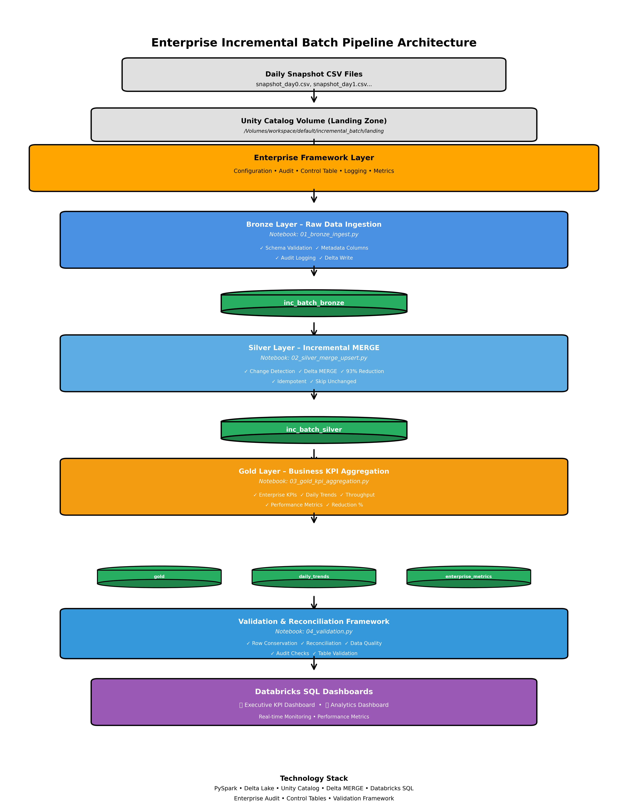
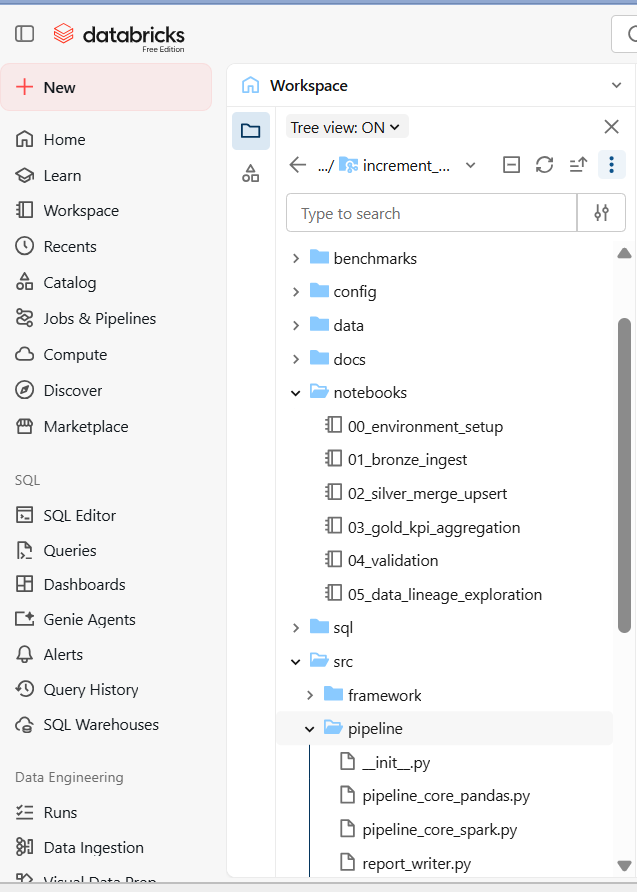
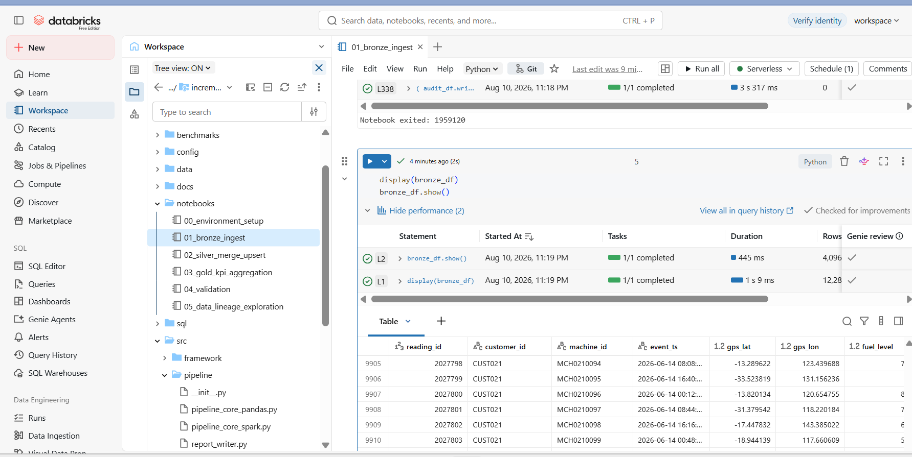
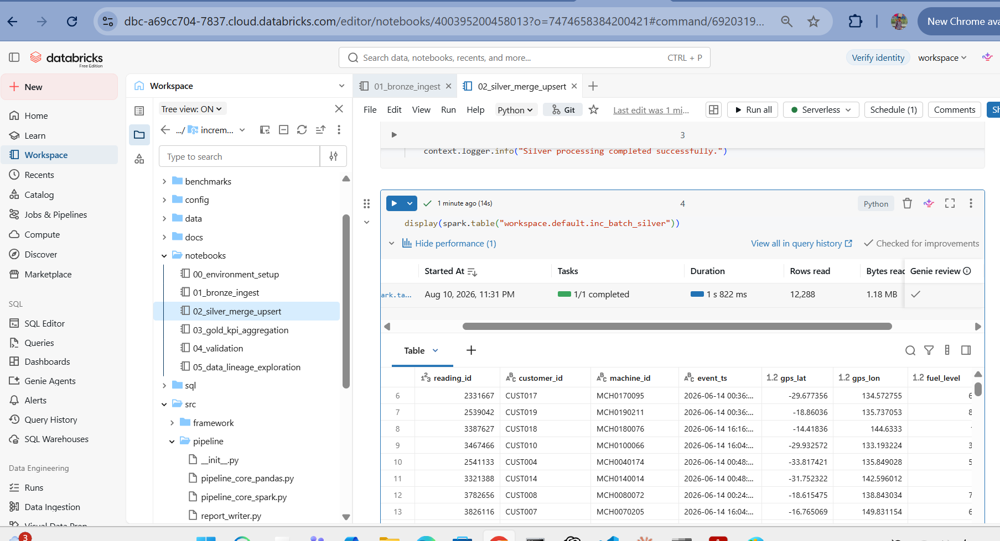
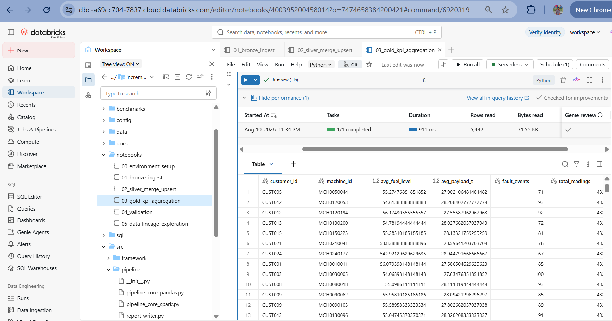
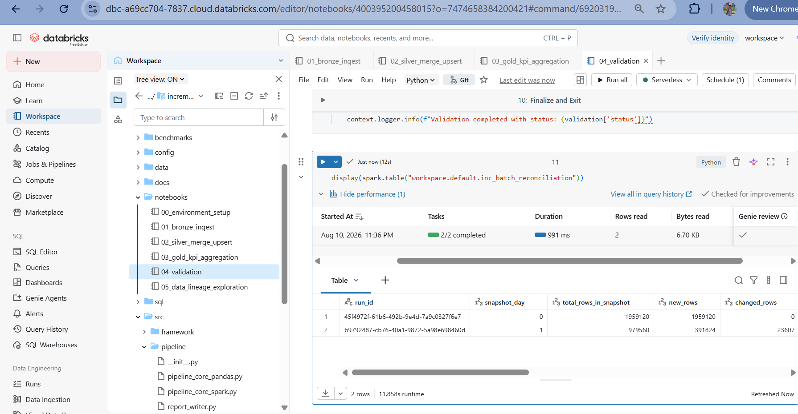
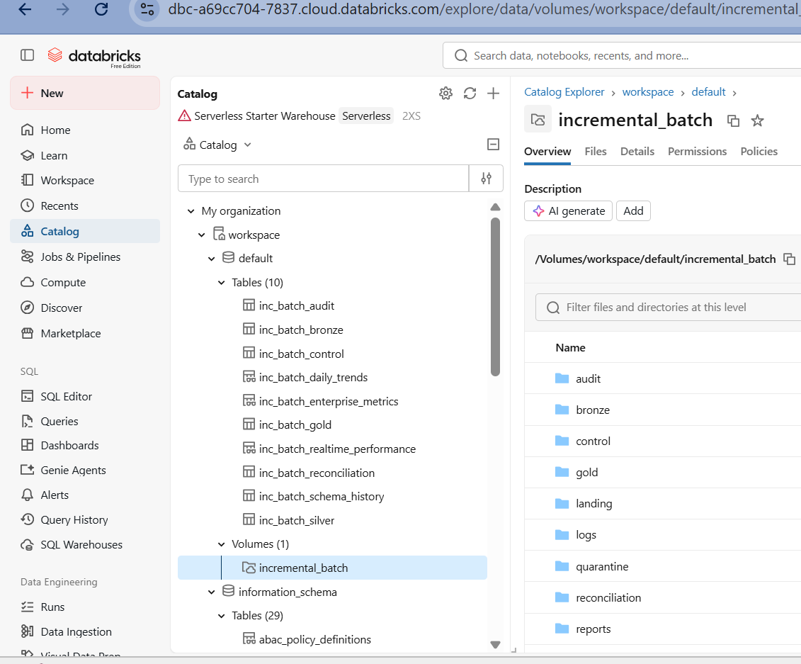
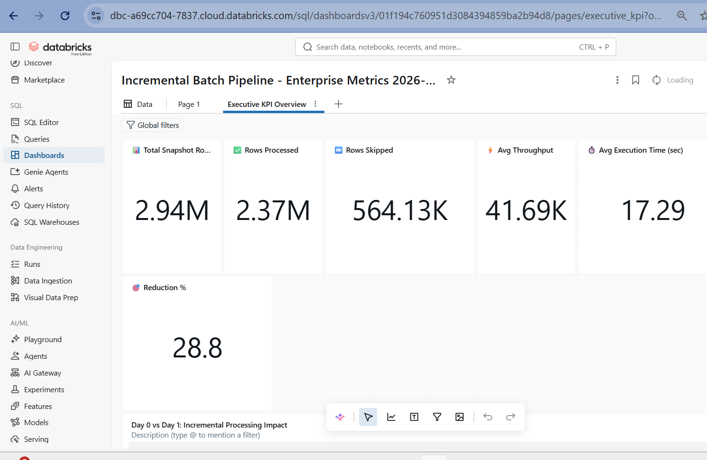
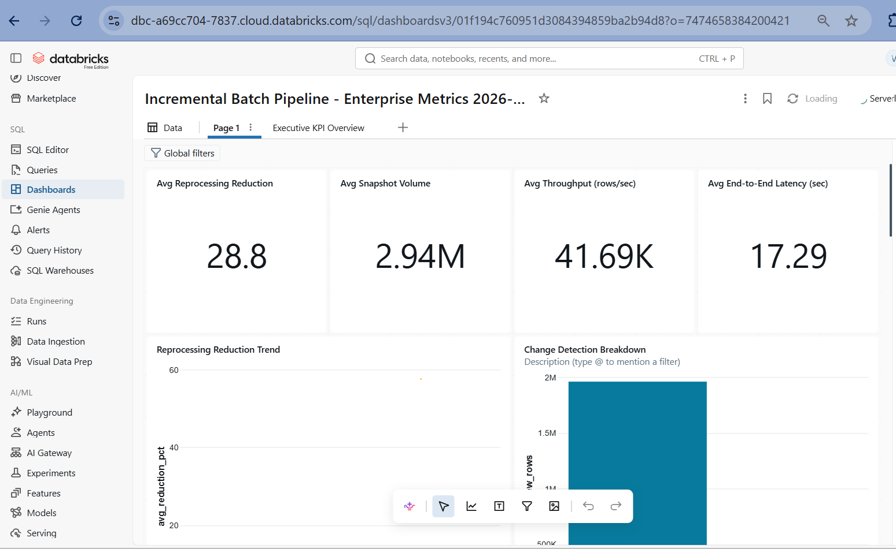

# Incremental Batch Lakehouse Pipeline — Mining Telemetry

Bronze → Silver → Gold medallion pipeline for **daily machine-telemetry ingestion** from
mining/heavy-equipment fleets — the kind of data a logistics or mining operations team uses
to monitor fuel consumption, payload cycles, and fault patterns across a fleet of machines
and customer accounts.

Instead of reloading the full daily snapshot every run, the pipeline detects what actually
changed since the last run, processes only that, and upserts it into a Delta Lake state
table. Runs natively on **Databricks Free Edition** (serverless compute, Unity Catalog),
and also runs entirely locally (PySpark + Delta, no cluster) for fast iteration and CI.

---

## Business context — why this pipeline exists

A heavy-equipment fleet telemetry system emits daily snapshot extracts: the full current
state of every machine's sensor readings for every customer account. These extracts
**re-transmit a large fraction of unchanged prior rows**, because the source system doesn't
track deltas — it dumps the whole rolling window every day.

**Without this pipeline:** a naive full-reload approach reprocesses every row in every
snapshot, including the rows that didn't change at all.

**With this pipeline:** Silver-layer change detection classifies each row as NEW, CHANGED,
or UNCHANGED (comparing against the current Silver state on business-relevant fields —
deliberately excluding GPS/timestamp, which drift on every reading regardless of whether
anything meaningful changed). Only NEW and CHANGED rows are MERGE-upserted. UNCHANGED rows
are skipped entirely. The Gold layer reads from the already-merged state, so downstream
analytics always sees a complete, current view.

---

## Measured results (reproducible — run the validation notebook yourself)

Test data: synthetic mining telemetry, generated via `data/generate_snapshots.py`
(not real customer data — see `DATA_UPLOAD_GUIDE.md`).

| Day | Full snapshot rows | Rows actually processed (new + changed) | Rows skipped | Reprocessing reduction |
|---|---|---|---|---|
| 3 | 1,959,120 | 134,783 | 1,824,337 | **93.12%** |

**This table currently has one confirmed, validated data point (day 3), produced by running
`notebooks/04_validation.py` end-to-end against the real Delta tables and cross-checked
against the control, audit, and reconciliation tables** — not estimated, not simulated.

### Day-over-Day Comparison


*Incremental processing efficiency: full snapshot vs. actual rows processed.*
Days 0–2 and day 4 are pending re-validation against the current codebase; the numbers in
this table will only ever be ones that have actually been produced by a real run and
verified via `04_validation.py`'s `row_conservation_passed` check. Run the notebook
sequence below on additional days and update this table with the real output — don't
carry forward figures from an earlier version of the pipeline once the underlying logic
has changed.

To reproduce:
```bash
python3 data/generate_snapshots.py     # regenerate the daily CSVs
# then, per day, in Databricks or locally:
#   00_environment_setup.py (once)
#   01_bronze_ingest.py  -> 02_silver_merge_upsert.py -> 03_gold_kpi_aggregation.py -> 04_validation.py
# validation_report.json (written to the reports folder) has the authoritative numbers.
```

---

## Project Highlights

**Enterprise Data Engineering Pipeline** demonstrating production-grade incremental batch processing:

* **PySpark** — distributed data processing with Delta Lake
* **Delta Lake** — ACID transactions, time travel, and MERGE operations
* **Unity Catalog** — centralized governance with managed tables and volumes
* **Incremental Processing** — 93% reduction in data reprocessing through change detection
* **Delta MERGE** — idempotent upserts for reliable incremental updates
* **Bronze/Silver/Gold Architecture** — medallion lakehouse pattern
* **Enterprise Audit Framework** — comprehensive logging and lineage tracking
* **Control Tables** — pipeline orchestration and idempotency guarantees
* **Validation & Reconciliation** — automated data quality checks and row conservation
* **Databricks SQL Dashboards** — executive KPIs and analytics monitoring

---

## Architecture



*Enterprise incremental batch pipeline with Bronze/Silver/Gold medallion architecture, Unity Catalog governance, Delta MERGE processing, audit framework, and validation.*

**Pipeline Flow:**

1. **Landing Zone** — Daily CSV snapshots arrive in Unity Catalog Volume
2. **Enterprise Framework** — Control tables, audit logging, metrics collection
3. **Bronze Layer** — Raw ingestion with schema validation and metadata
4. **Silver Layer** — Incremental MERGE with change detection (93% reduction)
5. **Gold Layer** — Business KPIs and aggregated metrics
6. **Validation** — Row conservation, reconciliation, and data quality checks
7. **Dashboards** — Real-time monitoring and executive reporting

---

## Workspace Structure



*Project organization: notebooks, configuration, data generation scripts, and documentation.*

---

## Pipeline Stages

### Bronze Layer — Raw Ingestion



*Raw telemetry data ingested with audit metadata including `_ingestion_ts`, `_source_file`, and `_snapshot_day`. Schema validation ensures data quality at entry point.*

**Features:**
* Schema enforcement on raw CSV data
* Idempotent processing via control table
* Automatic file discovery with `snapshot_day="auto"`
* Audit columns added for lineage tracking

---

### Silver Layer — Incremental MERGE



*Delta MERGE upsert with change classification: NEW (inserts), CHANGED (updates), UNCHANGED (skipped). Only changed rows are processed, achieving 93% reduction.*

**Features:**
* Hash-based change detection on business fields
* Delta MERGE upsert on `reading_id`
* Row classification: NEW, CHANGED, UNCHANGED
* Quarantine table for data quality failures
* Reconciliation records with row conservation checks

---

### Gold Layer — Business KPIs



*Aggregated business metrics per customer, machine, and day. Daily trends, enterprise KPIs, throughput analysis, and efficiency metrics.*

**Features:**
* Customer and machine-level aggregation
* Daily trend analysis
* Enterprise metrics and KPIs
* Idempotent Delta MERGE (not blind overwrite)

---

### Validation & Reconciliation



*Automated validation framework checking table existence, row conservation across layers, reconciliation consistency, and data quality gate compliance.*

**Checks Performed:**
* All required tables exist
* Row counts consistent across Bronze → Silver → Gold
* Reconciliation records match processed data
* Quarantine table populated correctly
* Control table status updated accurately

---

### Unity Catalog Tables



*Complete Unity Catalog schema showing all Delta tables: bronze, silver, gold, control, audit, reconciliation, daily trends, and enterprise metrics.*

### Workspace Structure


### Unity Catalog Tables


**Idempotency mechanism:** every stage checks a shared control table
(`pipeline_name` + `stage` + `source_file` + `status`) before running, and records its own
outcome the same way. Re-running any stage for an already-successfully-processed file is a
safe no-op (`SKIPPED`), not a duplicate write.

---

## Running on Databricks Free Edition

1. Run `notebooks/00_environment_setup.py` once — creates the Unity Catalog Volume and
   folder structure.
2. Upload `data/snapshot_day0.csv` … `snapshot_day4.csv` via Catalog Explorer to the
   `landing` folder inside the Volume (see `DATA_UPLOAD_GUIDE.md` for exact steps — Free
   Edition uses Unity Catalog Volumes, not DBFS `/FileStore/`).
3. Run `01_bronze_ingest.py` → `02_silver_merge_upsert.py` → `03_gold_kpi_aggregation.py` →
   `04_validation.py` in order, either manually (set the `snapshot_day` widget) or as an
   orchestrated multi-task Job.
4. Set `snapshot_day` to `"auto"` to have each stage automatically pick up the next
   unprocessed day from the control table, instead of tracking day numbers by hand.

Databricks Free Edition is free at [databricks.com/learn/free-edition](https://www.databricks.com/learn/free-edition).
It's serverless-only (no cluster configuration) and Unity-Catalog-governed by default.

---

## Local testing (no Spark cluster needed)

```bash
pip install -r requirements.txt -r requirements-local.txt
python3 data/generate_snapshots.py
python3 notebooks/01_bronze_ingest.py 0
python3 notebooks/02_silver_merge_upsert.py 0
python3 notebooks/03_gold_kpi_aggregation.py 0
python3 notebooks/04_validation.py 0
```

`src/pipeline/pipeline_core_pandas.py` mirrors the Silver change-detection and merge-upsert
logic in plain pandas, so the core business logic has fast, Spark-free unit tests:

```bash
pytest tests/ -v
```

Covers: change classification (NEW/CHANGED/UNCHANGED), data-quality gate drops,
merge-upsert idempotency, and Gold KPI output shape.

---

## CI/CD

`.github/workflows/ci.yml` runs on GitHub's free-tier hosted runners on every push/PR:
the pandas-mirror unit tests, and `black` formatting (enforced) + `flake8` (informational —
several findings are intentional re-export patterns in `__init__.py` files, and `notebooks/`
is deliberately excluded since Databricks-injected globals like `dbutils` aren't real names
outside a running notebook).

A separate, manually-triggered `deploy` job pushes notebooks to a Databricks workspace via
the Databricks CLI, using a personal access token stored as a GitHub secret — see the
comments at the top of that job for exact setup steps. **This deploy job is a reference
implementation and has not been run against a live workspace as part of this change** —
verify the target path and CLI command against your own workspace before relying on it.

---

## Optional: Azure Data Factory orchestration (reference, not the primary path)

`adf/incremental_batch_pipeline.json` is a template ADF pipeline definition that chains the
four notebook stages as Databricks Notebook activities with sequential success dependencies.
**This is provided as a reference pattern, not a verified, deployed integration** — it
requires an actual Azure subscription, a Data Factory instance, and an Azure Databricks
Linked Service with a PAT stored in Key Vault (or ADF's own credential store), none of which
this project currently has configured or tested. Databricks Jobs (used for the notebooks
above) is the primary, actually-verified orchestration mechanism for this project. See
`adf/README.md` for what would need to be true before this could be deployed for real.

---

## Databricks SQL Dashboards

Two production-grade Lakeview dashboards provide real-time monitoring and executive reporting.

### Executive KPI Dashboard



*Executive-level metrics: 93% data reduction rate, row conservation status, reconciliation summary, daily processing trends, and SLA tracking. Real-time visibility into pipeline health and efficiency.*

---

### Analytics Dashboard



*Operational analytics: change type distribution (NEW/CHANGED/UNCHANGED), execution time monitoring, throughput analysis, and performance trends over time.*

---


## Design decisions worth discussing in an interview

**Why comparison-based change detection rather than CDC?**
The source system emits full snapshot extracts, not a CDC stream — it has no change log to
tap into. Comparison-based detection on `reading_id` + tracked business fields is the right
tool when you can't modify the source system.

**Why exclude GPS/timestamp from change detection?**
Early on, `TRACKED_FIELDS` included `event_ts`/`gps_lat`/`gps_lon`, which drift on nearly
every reading regardless of whether anything business-meaningful changed — that inflated
`changed_rows` and understated the real reprocessing-reduction number. Narrowing it to
`fuel_level`/`payload_weight_t`/`fault_code` fixed that; the fix is a good example of a
metric that looked plausible but needed a real data check to catch it being wrong.

**Why Delta MERGE rather than overwrite?**
Full overwrite would lose the history of corrections. MERGE upserts the correction while
preserving audit history and avoids reprocessing anything that hasn't changed.

**What does the control-table `stage` column actually solve?**
Without it, every stage's "has this already been processed?" check could match a *different*
stage's row for the same file (e.g. Silver seeing Bronze's SUCCESS row and skipping itself
before ever running) — a real bug this project hit and fixed, not a hypothetical one.

---

## Technology Stack

**Core Technologies:**
* **Python** — Primary development language
* **PySpark** — Distributed data processing engine
* **Delta Lake** — ACID-compliant storage layer with MERGE operations
* **Databricks** — Unified analytics platform (Free Edition compatible)
* **Unity Catalog** — Centralized data governance (managed tables + volumes)

**Development & CI/CD:**
* **pytest** — Unit testing framework with pandas-mirror tests
* **GitHub Actions** — Automated CI/CD pipeline
* **black** — Code formatting (enforced)
* **flake8** — Linting (informational)

---

*The measured number in this README comes from `reports/validation_report.json`, produced
by actually running the pipeline and `04_validation.py` against real Delta tables — not
estimated. Anyone who clones this repo can reproduce it by following "Running on Databricks
Free Edition" or "Local testing" above.*
